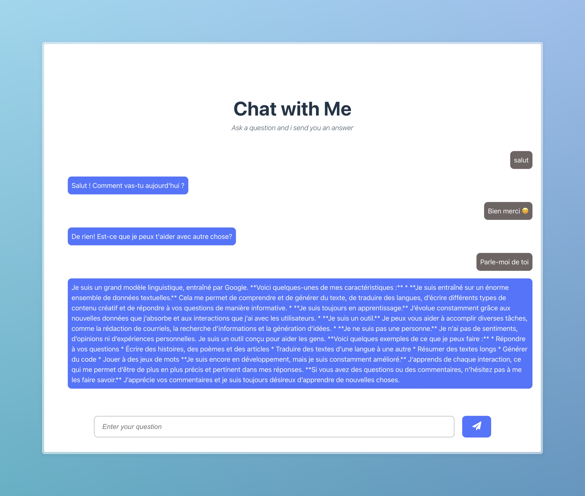

# Chat with me

Chat with Gemini AI and get an answer

## How to use

1. Clone the repository

   ```bash
   git clone https://github.com/Moh7ven/chat-with-gemini-app.git
   ```

2. Enter your gemini API key in the **_.env _** file

3. Install the dependencies

   ```bash
   npm install
   ```

4. move to server folder

   ```bash
   cd server
   ```

5. Genarate prisma schema

   ```bash
   npx prisma generate
   ```

6. Push the database

   ```bash
   npx prisma db push
   ```

7. Start react server

   ```bash
   npm run dev
   ```

8. Start gemini server

   ```bash
   npm run serve
   ```

9. Open the browser and go to [http://localhost:5173/](http://localhost:5173/)

10. Image
    

11. Demo
   
